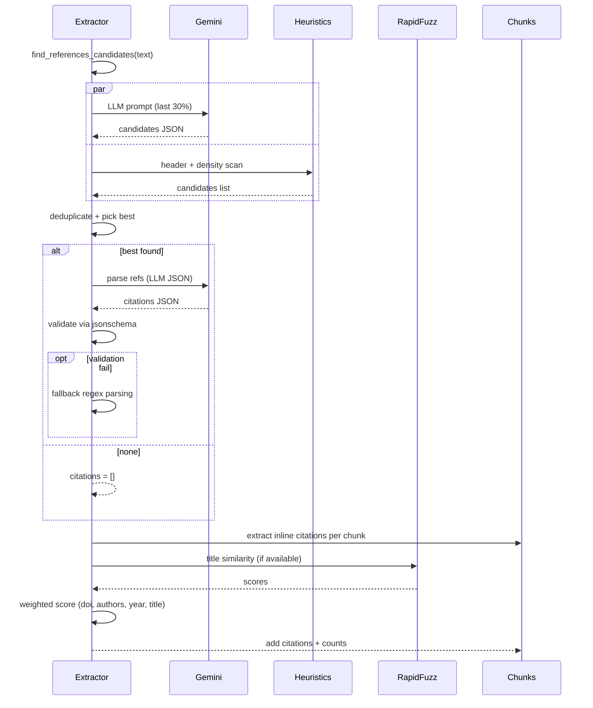

# Citation Extractor Upgrades

## Overview

The citation extraction system has been significantly enhanced with robust discovery methods, numbered reference parsing, improved matching algorithms, and comprehensive validation. This document explains the new features, configuration options, and migration notes.

## Architecture Diagrams

### High‑Level Flow

```mermaid
flowchart TD
  A[Full Document Text] --> B{Find References Candidates}
  B -->|LLM (last 30%)| B1[Gemini 1.5 Flash\n_candidates with confidence_]
  B -->|Heuristics| B2[Header + Density Scan\nREFERENCES/Bibliography/Works Cited]
  B1 --> C[Deduplicate + Sort]
  B2 --> C
  C --> D{Select Best Span?}
  D -- None --> E[No references found\nreturn []]
  D -- Best --> F[Extract References Section]
  F --> G{Parse Bibliography}
  G -->|LLM JSON + Schema| H[Structured Citations]
  G -->|Regex Fallback| I[Structured Citations]
  H --> J[Deduplicate Citations]
  I --> J
  J --> K[Extract Inline Citations per Chunk]
  K --> L{Map Inline → Full}
  L -->|Numeric [1,3-5]| L1[Parse Ranges\nMap via index_map]
  L -->|Author‑Year| L2[Identifiers: first_author, year\n(optional title/doi)]
  L1 --> M[Score Matches]
  L2 --> M
  M -->|score ≥ threshold| N[Create CitationMatch]
  M -->|else| O[Skip]
  N --> P[Enhance Chunks with Citations]
```

### Sequence (with guardrails)



## New Features

### 1. Robust References Discovery

The system now uses a two-stage approach to find reference sections:

**Stage A: LLM-Assisted Discovery**
- Searches the last 30% of documents for efficiency
- Returns candidate spans with confidence scores
- Handles documents with or without markdown headers

**Stage B: Heuristic Analysis**
- Scans for reference headers (REFERENCES, Bibliography, Works Cited, etc.)
- Calculates "reference density" based on structural indicators
- Finds high-density sections even without explicit headers

**Density Scoring Factors:**
- Numbered prefixes (`1.`, `1)`, `[1]`)
- Year patterns in parentheses `(2023)`
- Journal indicators (`vol.`, `issue`)
- DOI/URL presence
- Page number patterns (`pp. 123-145`)

### 2. Numbered Reference Parsing

Full support for numbered citation styles:

```python
# Parse numbered references into ordered map
index_map, citations = extractor.parse_numbered_references(ref_text)

# Resolve inline numeric citations
citations = extractor._resolve_numeric_citations("[3-5]", index_map)
# Returns citations 3, 4, and 5
```

**Supported Formats:**
- `1. Smith, J. (2023)...`
- `1) Smith, J. (2023)...`
- `[1] Smith, J. (2023)...`

**Range Resolution:**
- Single: `[5]` → citation 5
- Range: `[3-5]` → citations 3, 4, 5
- List: `[1,3,5]` → citations 1, 3, 5

### 3. Enhanced Matching Algorithm

The matching system now uses configurable weighted scoring:

```python
config = ExtractorConfig(
    title_weight=0.3,      # Title similarity weight
    author_weight=0.3,     # Author matching weight
    year_weight=0.2,       # Year exact match weight
    doi_weight=0.2,        # DOI exact match weight
    match_threshold=0.6    # Minimum score threshold
)
```

**Matching Components:**
- **DOI Exact Match**: Highest priority (2x weight bonus)
- **Title Similarity**: Uses rapidfuzz if available, token-based fallback
- **Author Matching**: Normalized name comparison with fuzzy matching
- **Year Matching**: Exact year comparison

**Title Normalization:**
- Lowercase conversion
- Unicode normalization (NFKD)
- Punctuation removal (except hyphens)
- Stopword removal
- Leading/trailing whitespace cleanup

### 4. DOI/URL Post-Processing

Automatic extraction and normalization of DOIs and URLs:

```python
# Extract and normalize DOI/URL
citation = extractor.fill_missing_doi_and_url(citation)

# Results in normalized citation.doi_url
# "doi:10.1234/example" → "https://doi.org/10.1234/example"
```

**Detection Patterns:**
- `doi:10.xxxx/yyyy`
- `https://doi.org/10.xxxx/yyyy`
- `https://example.com/paper`

**Preference Order:**
1. DOI (preferred, normalized to https://doi.org/ format)
2. URL (if no DOI found)

### 5. LLM Guardrails

Strict JSON validation with fallback mechanisms:

```python
# LLM returns structured format
{
  "citations": [
    {
      "raw_line": "1. Smith, J. (2023). Title here...",
      "parsed": {
        "authors": ["Smith, J."],
        "year": "2023",
        "title": "Title here",
        "journal": "Journal Name",
        "doi": "10.xxxx/yyyy",
        "citation_type": "journal"
      }
    }
  ]
}
```

**Validation Steps:**
1. JSON schema validation (if jsonschema available)
2. Required field checking (authors, year, title)
3. Regex fallback on validation failure
4. Confidence scoring based on extraction method

### 6. Configurable Context Windows

Smart context extraction around citations:

```python
config = ExtractorConfig(
    sentence_aware=True,           # Use sentence boundaries
    context_before_chars=100,      # Fallback char count
    context_after_chars=100        # Fallback char count
)
```

**Sentence-Aware Mode:**
- Attempts to return complete sentences around citations
- Falls back to character-based windows on failure
- Uses simple rule-based sentence splitting

## Configuration

### ExtractorConfig Class

```python
@dataclass
class ExtractorConfig:
    use_llm_for_refs: bool = True        # Use LLM for reference discovery
    sentence_aware: bool = True          # Sentence-aware context
    context_before_chars: int = 100      # Context before citation
    context_after_chars: int = 100       # Context after citation
    match_threshold: float = 0.6         # Minimum match confidence
    title_weight: float = 0.3            # Title similarity weight
    author_weight: float = 0.3           # Author matching weight
    year_weight: float = 0.2             # Year exact match weight
    doi_weight: float = 0.2              # DOI exact match weight
```

### Usage Examples

**Basic Usage (Backward Compatible):**
```python
# Works with existing code
extractor = CitationExtractor(llm_api_key="your_key")
citations, matches = extractor.extract_citations_from_document(text, chunks)
```

**Advanced Configuration:**
```python
# Custom configuration
config = ExtractorConfig(
    match_threshold=0.8,           # Stricter matching
    title_weight=0.4,              # Emphasize title similarity
    sentence_aware=False           # Use character-based context
)

extractor = CitationExtractor(
    llm_api_key="your_key",
    config=config
)
```

**Performance Tuning:**
```python
# Disable LLM for references discovery (faster)
config = ExtractorConfig(use_llm_for_refs=False)

# Smaller context windows (less memory)
config = ExtractorConfig(
    context_before_chars=50,
    context_after_chars=50
)
```

## Migration Guide

### Backward Compatibility

All existing code continues to work without changes:

```python
# This still works
extractor = CitationExtractor(llm_api_key="key", use_llm=True)
citations, matches = extractor.extract_citations_from_document(text, chunks)
```

### New Data Fields

The `Citation` class has new optional fields:

```python
@dataclass
class Citation:
    # Existing fields unchanged
    inline_text: str
    full_reference: str
    authors: List[str]
    year: Optional[str] = None
    # ... existing fields ...

    # New fields (optional, default values provided)
    raw_line: Optional[str] = None      # Original reference line
    doi_url: Optional[str] = None       # Normalized DOI/URL
    match_score: float = 0.0            # Calculated match confidence
```

### Gradual Adoption

You can adopt new features incrementally:

1. **Start with defaults**: Use new `CitationExtractor()` with default config
2. **Tune thresholds**: Adjust `match_threshold` based on your data quality
3. **Optimize performance**: Disable LLM features if speed is critical
4. **Custom weights**: Adjust matching weights based on your document types

## Performance Considerations

### Speed Optimizations

- **Disable LLM for references**: `use_llm_for_refs=False` (2-3x faster)
- **Smaller context windows**: Reduces memory usage
- **Higher match threshold**: Fewer false positives, faster processing

### Memory Optimizations

- **Limited LLM context**: Bibliography text truncated to 3000 chars
- **Efficient candidate deduplication**: O(n) overlap detection
- **Streaming processing**: Process references in chunks

### Accuracy vs Speed Tradeoffs

| Setting | Speed | Accuracy | Best For |
|---------|-------|----------|----------|
| Full LLM + Low threshold | Slow | High | Research documents |
| Heuristics only + High threshold | Fast | Medium | Large-scale processing |
| Hybrid + Medium threshold | Medium | High | Production systems |

## Troubleshooting

### Common Issues

**Low citation coverage:**
- Reduce `match_threshold` (try 0.4-0.5)
- Check reference section detection with `find_references_candidates()`
- Verify document format (PDF extraction quality)

**False positives:**
- Increase `match_threshold` (try 0.7-0.8)
- Adjust weight distribution (emphasize `doi_weight`)
- Review inline citation patterns

**Performance issues:**
- Disable `use_llm_for_refs` for large documents
- Reduce context window sizes
- Process documents in batches

### Debugging Tools

```python
# Check reference discovery
candidates = extractor.find_references_candidates(text)
for candidate in candidates:
    print(f"Confidence: {candidate.confidence}, Header: {candidate.header_text}")

# Inspect density scoring
section_text = "your reference section text"
density = extractor._calculate_reference_density(section_text)
print(f"Reference density: {density}")

# Test title similarity
similarity = extractor.title_similarity("Title A", "Title B")
print(f"Title similarity: {similarity}")
```

## Dependencies

### Required
- `langchain-google-genai` (existing)
- `langchain-core` (existing)

### New Optional
- `rapidfuzz>=3.0.0` - Better title similarity (recommended)
- `jsonschema>=4.0.0` - LLM output validation (recommended)

### Installation
```bash
pip install rapidfuzz>=3.0.0 jsonschema>=4.0.0
```

Without these packages, the system gracefully falls back to basic implementations.

## Testing

Run the comprehensive test suite:

```bash
# All enhanced citation tests
pytest tests/test_citation_extractor_enhanced.py -v

# Specific test categories
pytest tests/test_citation_extractor_enhanced.py::TestReferenceDiscovery -v
pytest tests/test_citation_extractor_enhanced.py::TestNumberedReferences -v
pytest tests/test_citation_extractor_enhanced.py::TestEnhancedMatching -v
```

## API Reference

### New Public Methods

```python
# Reference discovery
def find_references_candidates(text: str) -> List[SpanCandidate]
def select_best_references_span(candidates: List[SpanCandidate]) -> Optional[SpanCandidate]

# Numbered references
def parse_numbered_references(ref_text: str) -> Tuple[Dict[int, Citation], List[Citation]]

# Enhanced matching
def title_similarity(title_a: str, title_b: str) -> float
def normalize_title(title: str) -> str

# DOI/URL processing
def fill_missing_doi_and_url(citation: Citation) -> Citation
```

### Configuration Classes

```python
@dataclass
class SpanCandidate:
    start: int
    end: int
    confidence: float
    header_text: str
    density_score: float = 0.0

@dataclass
class ExtractorConfig:
    # See Configuration section above
```

This upgrade maintains full backward compatibility while providing powerful new capabilities for robust citation extraction in scientific documents.
## Data Written to Chunks

Each enhanced chunk gets citation fields:
- `citations`: array of objects with `inline_text`, `full_reference`, `authors[]`, `year`, `title`, `journal`, `doi`
- `citation_count`: integer count per chunk

Context fields aiding retrieval and display:
- `source_title`, `source_authors`, `source_year`, `source_journal`, `source_doi`, `reference_url`
- `page_start`, `page_end`, `section_hierarchy`, `hierarchy_breadcrumb`
- `text` (full chunk content), `chunk_size`, `word_count`, `sentence_count`

## Configuration (At a Glance)

- Model: `gemini-1.5-flash` (low temperature 0.1 for parsing stability)
- Weights: `title_weight=0.3`, `author_weight=0.3`, `year_weight=0.2`, `doi_weight=0.2`
- Threshold: `match_threshold=0.6`
- Context windows: sentence‑aware or char‑based (before=100, after=100)

## Failure Handling and Fallbacks

- LLM JSON schema validation errors → fallback to regex parsing.
- No references section found → return empty citations; matching will skip gracefully.
- Title similarity uses RapidFuzz when available, token Jaccard otherwise.
- Numeric citations not found in index map → warn and continue.

## Usage Notes

- Extraction runs on the full document text; chunking may use filtered text (interactive Stage 1.5) but full text is retained to preserve citation context.
- For consistent behavior/cost, prefer small prompts tuned for structure extraction; keep temperature low.
