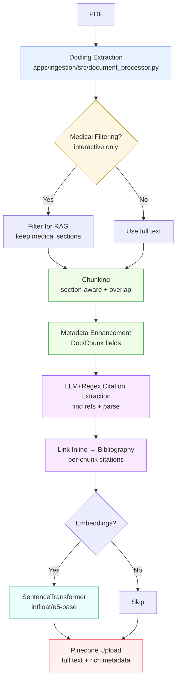
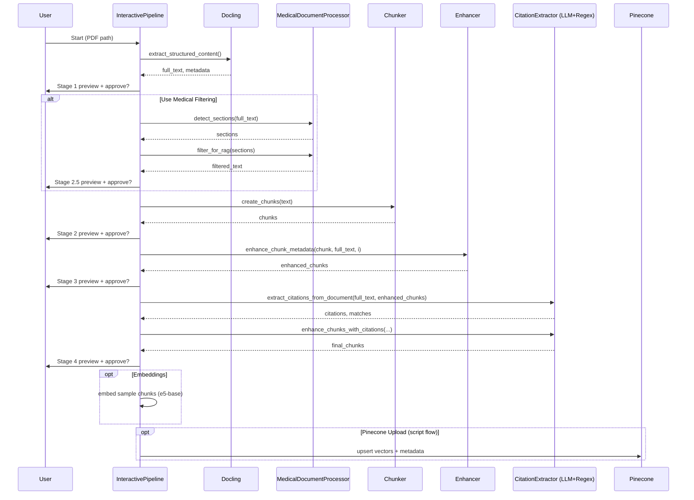

# Ingestion Pipeline — Detailed Flow and Step Reference

This document explains the ingestion pipeline end‑to‑end with Mermaid diagrams, step‑by‑step behavior, key parameters, and artifacts written to disk. It reflects the interactive and scripted flows.

## Overview

### Interactive Orchestration

## Stage Details

### Stage 1 — Docling Extraction
- Code: `apps/ingestion/src/document_processor.py`
- Input: PDF file path
- Processing:
  - Docling `DocumentConverter` with `PdfPipelineOptions`. Optional OCR/table structure.
  - `text_only=True` disables OCR/tables and lowers threads for fast pass.
- Key parameters:
  - `num_threads=8` (or 1 for text_only)
  - `do_ocr=True`, `do_table_structure=True`, `accelerator_device="auto"`
- Output objects:
  - `structured_content` dict (markdown text, raw doc, basic metadata)
  - `full_text` (markdown string)
- Artifacts (interactive): `1_raw_text/full_text.txt`, `structured_content.json`, `extraction_stats.json`

### Stage 2.5 - Medical Filtering (interactive)
- Code: `apps/ingestion/src/medical_document_processor.py`, orchestrated via CLI (`apps/ingestion/main.py stage --stage 2.5`)
- Input: `full_text` from Docling
- Processing:
  - `detect_sections(text)`: markdown header scan → academic section patterns.
  - `filter_for_rag(sections)`: keeps clinical content (abstract, intro, methods, results, discussion, conclusion, limitations, ethics; plus guideline‑specific sections). Excludes references/appendices/acknowledgments.
  - `analyze_document_structure(text)`: section counts, quality score, rag_content_ratio.
- Output value: `filtered_text` used for chunking (with user approval).
- Artifacts: `2.5_medical_filtering/filtered_medical_content.txt`, `detected_sections.json`, `filtering_stats.json`, `document_analysis.json`
- Rationale: Removes reference noise from retrievable corpus while preserving full document for downstream citation extraction.
- CLI note: The interactive runner labels this step Stage 2.5 even though it runs before chunking; this doc mirrors the CLI numbering so prompts/tooling line up.

### Stage 2 — Chunking
- Code: `apps/ingestion/src/chunk_processor.py`
- Input: `filtered_text` from Stage 2.5 (or `full_text` if filtering skipped)
- Processing:
  - Section‑aware chunking when headers found; otherwise recursive splitter fallback.
  - Overlap applied (capped at ≤20% of chunk size) and oversized/undersized handling.
- Default parameters:
  - `target_chunk_size=500`, `overlap_size=50`, `min_chunk_size=250`, `max_chunk_size=750`
- Per‑chunk metadata:
  - `chunk_id`, `content_hash`, `chunk_size`, `word_count`, `sentence_count`, `starts_with`, `section_title`, method flags.
- Artifacts (interactive): `2_chunks/chunk_XXX.json`, `chunking_stats.json`

### Stage 3 — Metadata Enhancement
- Code: `apps/ingestion/src/metadata_enhancer.py`
- Input: chunks, `full_text`
- Processing:
  - Document‑level: extract title/authors/year/journal/DOI, build `source_citation` and classify `document_type`.
  - Chunk‑level: estimate pages, build section hierarchy and breadcrumb, compute preview and statistics, generate citeable `citation_text`, set `reference_url` if DOI present.
- Output: enriched Document objects with a rich `metadata` dict (includes FULL chunk text at `metadata['text']`).
- Artifacts (interactive): `3_enhanced_chunks/enhanced_chunk_XXX.json`, `sample_metadata.json`
- Why keep it: Stage 3 stitches provenance into each chunk (breadcrumbs, citation text, document-level keys) so Stage 4 can match inline cites and the UI can show titles/authors without post-processing.

### Stage 4 — Citation Extraction and Linking (LLM + Regex)
- Code: `apps/ingestion/src/citation_extractor.py`
- Input: `full_text`, enhanced chunks
- Processing:
  - References discovery: LLM‑assisted (Gemini 1.5 Flash) + heuristic density.
  - Bibliography parsing: LLM JSON with schema validation → fallback robust regex.
  - Inline extraction: author‑year and numeric styles from chunk text with context windows.
  - Matching: weighted scoring (DOI > authors > year > title; RapidFuzz for title similarity if available).
  - Numeric resolution: map `[3-5]` into individual citations when numbered references detected.
- Output additions (per chunk):
  - `metadata['citations']` list (inline_text, full_reference, authors, year, title, journal, doi)
  - `metadata['citation_count']`
- Artifacts (interactive): `4_citations/extracted_citations.json`, `citation_matches.json`, `final_chunks_with_citations.json`, `citation_stats.json`

### Stage 5 — Embeddings (optional)
- Code: `apps/ingestion/src/vector_uploader.py`
- Input: final chunks with citations
- Processing: SentenceTransformer `intfloat/e5-base` with `passage:` prefix and normalization.
- Artifacts (interactive): `5_embeddings/sample_embeddings.npy`, `embedding_metadata.json`

### Stage 6 — Pinecone Upload (scripted flow)
- Code: `apps/ingestion/src/vector_uploader.py`
- Input: final chunks
- Processing: upsert vectors with full metadata to the configured `index_name` + `namespace`.
- Metadata highlights:
  - `text` (full chunk content) + source fields (title/authors/year/journal/DOI)
  - Location fields (page_start/end, hierarchy_breadcrumb), size/stats, citation summaries, derived tags.

## Configuration Snapshot
- Shared defaults (see `shared/config/settings.py`):
  - `PINECONE_INDEX_NAME=medical-rag-index`, `PINECONE_NAMESPACE=thera-rag`
  - `EMBEDDING_MODEL=intfloat/e5-base`
  - `LLM_MODEL=gemini-2.5-pro`, `LLM_TEMPERATURE=0.1`, `LLM_MAX_TOKENS=8192`, `RETRIEVAL_K=15`
  - Chunking: `chunk_size=500`, `chunk_overlap=50`
- Ingestion LLM (citations): `gemini-1.5-flash` (apps/ingestion/src/citation_extractor.py)

## Rationale and Tips
- Medical filtering improves retrieval by excluding reference lists from chunking while preserving full‐document citation extraction.
- Rich metadata and full text in Pinecone enable strong UI references and flexible post‑processing without returning to the original PDFs.
- Keep embeddings consistent across ingestion/inference (e5‑base set on both ends).

