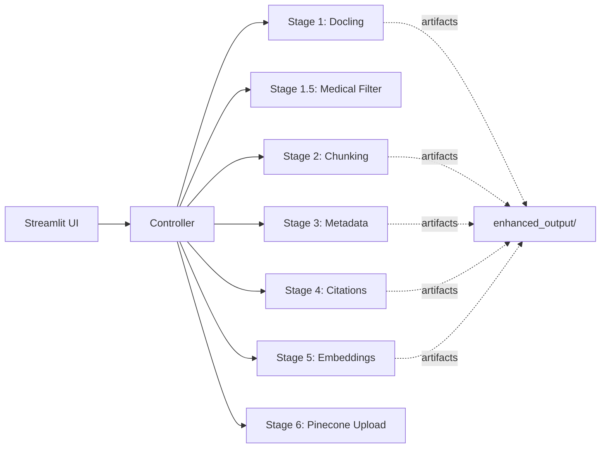
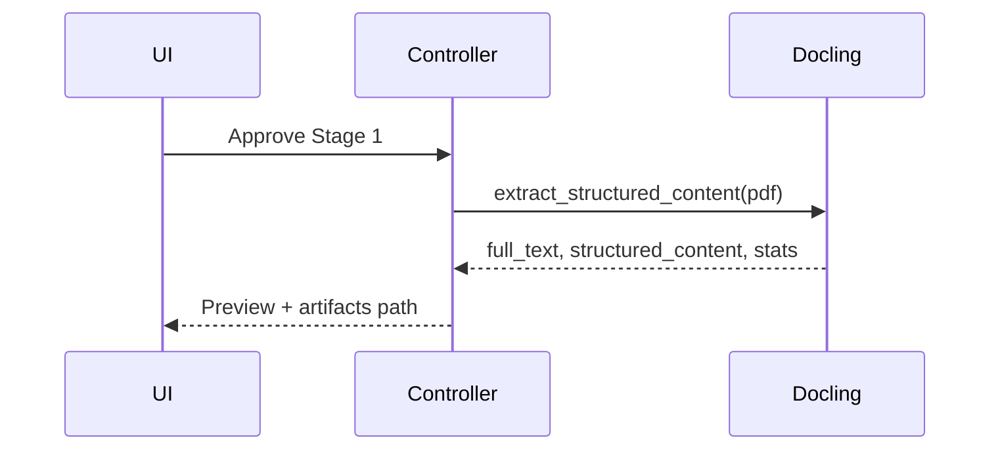

# HITL Ingestion Web App — Design Spec

This document proposes a Streamlit‑based web application to control the ingestion pipeline with human‑in‑the‑loop (HITL) approvals at each stage. It wraps the existing ingestion components without changing their core logic.

## Goals
- One‑click, guided ingestion for non‑CLI users
- Stage‑by‑stage preview with Approve/Reject/Retry control
- Clear visibility into what is kept vs filtered, chunk stats, and citations
- Optional embeddings + Pinecone upload with confirmation

## Scope
- Web UI for ingestion only (Inference UI remains separate in apps/inference)
- Uses existing modules:
  - DoclingBookLoader (Stage 1)
  - MedicalDocumentProcessor (Stage 1.5, optional)
  - SmartChunker (Stage 2)
  - DocumentMetadataExtractor + ChunkMetadataEnhancer (Stage 3)
  - CitationExtractor (Stage 4)
  - SentenceTransformer/Pinecone uploader (Stage 5/6)

## High‑Level Architecture

### Sequence per Stage (example: Stage 1)

## UI Design (Streamlit)

### Sidebar Controls
- File input
  - Upload PDF or select from `data/` directory
- Options
  - Text‑only extraction (fast)
  - Medical filtering (Stage 1.5)
  - Create embeddings (Stage 5)
  - Upload to Pinecone (Stage 6)
- Settings
  - Pinecone index/namespace (default from env)
  - Embedding model (default e5‑base)
  - LLM API key presence check

### Main Panel (Stepper)
- Stage 1 (Docling)
  - Show extraction stats and first paragraphs
  - Approve / Retry
- Stage 1.5 (Medical Filtering; optional)
  - Show section list, filtered vs original length, rag_content_ratio
  - Preview filtered content
  - Approve / Retry / Skip
- Stage 2 (Chunking)
  - Show chunk count, length distribution, first 3 chunk previews
  - Approve / Retry
- Stage 3 (Metadata Enhancement)
  - Show sample enriched metadata (first chunk)
  - Approve / Retry
- Stage 4 (Citations)
  - Show extracted citations, matches, coverage %, first 3 examples
  - Approve / Retry
- Stage 5 (Embeddings; optional)
  - Show sample embeddings stats (dims, mean/std); Approve / Skip
- Stage 6 (Upload; optional)
  - Confirm destination index/namespace and vector count; Upload

## State Management
- Session state keys (Streamlit):
  - `uploaded_file_path`, `options` (text_only, medical_filter, do_embeddings, do_upload)
  - Stage outputs: `stage1`, `stage15`, `stage2`, `stage3`, `stage4`, `stage5`
  - Approval flags per stage
  - `artifact_dir` under `enhanced_output/<doc_name>/`

## Controller APIs (internal)
Proposed thin controller functions wrapping existing modules:
- `run_stage1(file_path, text_only) -> { full_text, structured_content, stats }`
- `run_stage1_5(full_text) -> { filtered_text, sections, analysis, stats }`
- `run_stage2(text_for_chunking, structured_content, file_path) -> { chunks, stats }`
- `run_stage3(chunks, full_text, doc_name) -> { enhanced_chunks, sample_metadata }`
- `run_stage4(full_text, enhanced_chunks) -> { citations, matches, final_chunks, stats }`
- `run_stage5(final_chunks) -> { sample_embeddings, embedding_metadata }`
- `upload_to_pinecone(final_chunks, index, namespace) -> { uploaded, errors }`

These functions can be implemented by reusing CLI stage functions in `apps/ingestion/src/stages.py`.

## Non‑Functional Requirements
- Responsiveness: Long operations should show progress (spinners, progress bars)
- Fault isolation: Failure at a stage should show error and allow Retry
- Idempotency: Approving a stage writes artifacts; re‑running should overwrite or version them under the same doc folder
- Security: Do not log secret values; rely on `.env` for keys

## Deployment
- Local: `streamlit run apps/ingestion/webapp/main.py`
- Streamlit Cloud: Configure environment secrets (GOOGLE_API_KEY, PINECONE_API_KEY, etc.)

## Initial Implementation Plan
1) Add a thin controller layer in `apps/ingestion/webapp/controller.py` to call existing stages
2) Build `apps/ingestion/webapp/main.py` (Streamlit UI), one stage at a time
3) Add progress indicators and artifact previews
4) Add Pinecone upload confirmation + post‑upload verification

## Future Enhancements
- Multi‑document queue and batch view
- Editable metadata/citation fixes in‑app (small form to correct a citation and reattach)
- Background job runner with job history (e.g., simple SQLite + threads)

