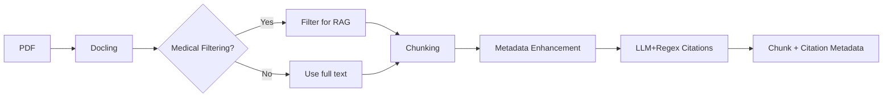

# DEPRECATED\n\nThis guide referenced an old interactive pipeline script. Please use the new stage-aware CLI documented in docs/INGESTION_CLI.md.\n\n# Interactive Pipeline Usage

## Overview

The interactive pipeline processes medical documents with user approval at each stage, giving you complete control over quality and allowing detailed inspection of intermediate outputs.

### Visual Flow



See the full step‑by‑step reference in `docs/INGESTION_PIPELINE.md`.

## Usage

```bash
# Basic usage
python scripts/interactive_pipeline.py path/to/document.pdf

# Custom output directory
python scripts/interactive_pipeline.py document.pdf --output-dir my_output

# Don't save intermediate files (just preview)
python scripts/interactive_pipeline.py document.pdf --no-save
```

## Environment Setup

Set these environment variables for full functionality:

```bash
export GOOGLE_API_KEY="your_google_api_key"     # For LLM citation extraction
export PINECONE_API_KEY="your_pinecone_key"     # For vector storage (optional)
```

## Citation Extractor Configuration

The enhanced citation extraction system supports extensive configuration:

### Basic Configuration
```python
from src.ingestion import ExtractorConfig

# Default settings (recommended)
config = ExtractorConfig()

# Performance-optimized (faster, less accurate)
config = ExtractorConfig(
    use_llm_for_refs=False,       # Disable LLM for reference discovery
    match_threshold=0.7           # Stricter matching
)

# Accuracy-optimized (slower, more accurate)
config = ExtractorConfig(
    match_threshold=0.4,          # More permissive matching
    title_weight=0.4,             # Emphasize title similarity
    context_before_chars=150,     # Larger context windows
    context_after_chars=150
)
```

### Advanced Settings
```python
config = ExtractorConfig(
    use_llm_for_refs=True,        # Use LLM for reference discovery
    sentence_aware=True,          # Sentence-aware context extraction
    context_before_chars=100,     # Character context fallback
    context_after_chars=100,
    match_threshold=0.6,          # Minimum match confidence
    title_weight=0.3,             # Title similarity importance
    author_weight=0.3,            # Author matching importance
    year_weight=0.2,              # Year exact match importance
    doi_weight=0.2                # DOI exact match importance
)
```

## Interactive Flow

### Stage 1: Text Extraction
```
STAGE 1: RAW TEXT EXTRACTION
==================================================
Extracted 15,423 characters, 3,456 words
Found 45 paragraphs across 234 lines

FIRST 3 PARAGRAPHS:

Paragraph 1:
  Background: Therapeutic interventions in oncology have evolved...

Paragraph 2:
  Methods: This systematic review analyzed 847 studies from...

Paragraph 3:
  The primary endpoint was overall survival measured at...

Proceed with text extraction? [y/n/preview]:
```

**Options:**
- `y` - Approve and continue to chunking
- `n` - Stop processing (saves current stage if enabled)
- `preview` - Show more detailed preview (future enhancement)

### Stage 2: Chunking
```
STAGE 2: CHUNKING
==================================================
Created 23 chunks
Average length: 485 characters
Range: 234 - 892 characters

FIRST 3 CHUNKS:

Chunk 1 (456 chars):
  Background: Therapeutic interventions in oncology have evolved significantly...

Chunk 2 (523 chars):
  Methods: This systematic review analyzed 847 studies from PubMed...

Proceed with chunking? [y/n/preview]:
```

### Stage 3: Metadata Enhancement
```
STAGE 3: METADATA ENHANCEMENT
==================================================
Enhanced 23 chunks with metadata
Metadata fields per chunk: 12

SAMPLE METADATA (first chunk):
  source_file: medical_paper.pdf
  processed_at: 2025-01-20T10:30:45
  chunk_index: 0
  section_title: Background
  content_type: text
  word_count: 78

Proceed with metadata enhancement? [y/n/preview]:
```

### Stage 4: Citation Extraction
```
STAGE 4: CITATION EXTRACTION
==================================================
Extracted 15 citations
Found 28 citation-to-chunk matches
Coverage: 65.2% of chunks have citations

FIRST 3 CITATIONS:

Citation 1:
  Inline: (Smith et al., 2023)
  Authors: ['Smith', 'Johnson', 'Williams']
  Year: 2023

Citation 2:
  Inline: (Brown & Davis, 2022)
  Authors: ['Brown', 'Davis']
  Year: 2022

Proceed with citation extraction? [y/n/preview]:
```

### Stage 5: Embeddings (Optional)
```
STAGE 5: EMBEDDINGS
==================================================
Created embeddings for 5 sample chunks
Embedding dimensions: 768
Data type: float32

EMBEDDING STATISTICS:
  Chunk 1: mean=0.0234, std=0.1456
    Text: Background: Therapeutic interventions in oncology...
  Chunk 2: mean=-0.0156, std=0.1234
    Text: Methods: This systematic review analyzed 847...

Proceed with embeddings? [y/n/preview]:
```

## Output Structure

When you approve stages, files are saved in this structure:

```
enhanced_output/
└── document_name/
    ├── 1_raw_text/
    │   ├── full_text.txt
    │   ├── structured_content.json
    │   └── extraction_stats.json
    ├── 2_chunks/
    │   ├── chunk_001.json
    │   ├── chunk_002.json
    │   ├── ...
    │   └── chunking_stats.json
    ├── 3_enhanced_chunks/
    │   ├── enhanced_chunk_001.json
    │   ├── enhanced_chunk_002.json
    │   ├── ...
    │   └── sample_metadata.json
    ├── 4_citations/
    │   ├── extracted_citations.json
    │   ├── citation_matches.json
    │   ├── final_chunks_with_citations.json
    │   └── citation_stats.json
    └── 5_embeddings/
        ├── sample_embeddings.npy
        └── embedding_metadata.json
```

## File Contents

### 1_raw_text/
- **full_text.txt**: Complete extracted text
- **structured_content.json**: Docling's structured output with layout info
- **extraction_stats.json**: Word count, character count, paragraph count

### 2_chunks/
- **chunk_XXX.json**: Individual chunks with content and basic metadata
- **chunking_stats.json**: Count, size distribution, total characters

### 3_enhanced_chunks/
- **enhanced_chunk_XXX.json**: Chunks with rich metadata (section info, context, etc.)
- **sample_metadata.json**: Example of metadata fields added

### 4_citations/
- **extracted_citations.json**: All citations with authors, years, journals, etc.
- **citation_matches.json**: Links between citations and chunks where they appear
- **final_chunks_with_citations.json**: Final chunks enhanced with citation data
- **citation_stats.json**: Coverage percentages, extraction quality metrics

### 5_embeddings/
- **sample_embeddings.npy**: Numpy array of embedding vectors
- **embedding_metadata.json**: Model info, dimensions, sample texts

## Benefits

1. **Quality Control**: Stop processing if text extraction looks poor
2. **Efficiency**: Don't waste time chunking garbled text
3. **Learning**: See what good vs bad extractions look like
4. **Debugging**: Isolate exactly where problems occur
5. **Inspection**: Examine data at every stage before proceeding
6. **Resumable**: Stop and restart at any point

## Examples

### Good Text Extraction
- Clean paragraph breaks
- Proper sentence structure
- No garbled characters
- Tables and figures properly handled

### Poor Text Extraction (stop here)
- Scrambled text
- Missing spaces between words
- Corrupted special characters
- Layout completely broken

### Good Chunking
- Logical break points
- Sentences not cut off mid-word
- Reasonable size distribution
- Context preserved

### Good Citation Extraction
- High coverage percentage (>50%)
- Citations properly parsed
- Authors and years extracted correctly
- Inline citations linked to full references

## Next Steps

After processing, you can:
1. Inspect individual files to understand each stage
2. Compare processing across different documents
3. Use the final chunks for RAG applications
4. Upload to Pinecone for vector search
5. Iterate on pipeline parameters based on results

